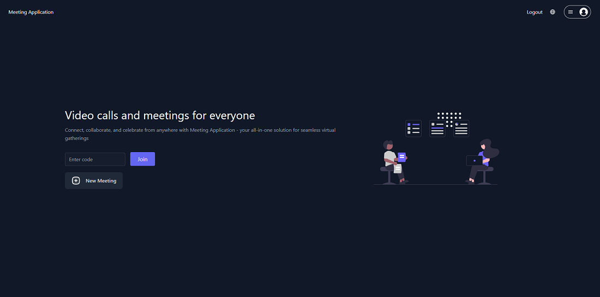
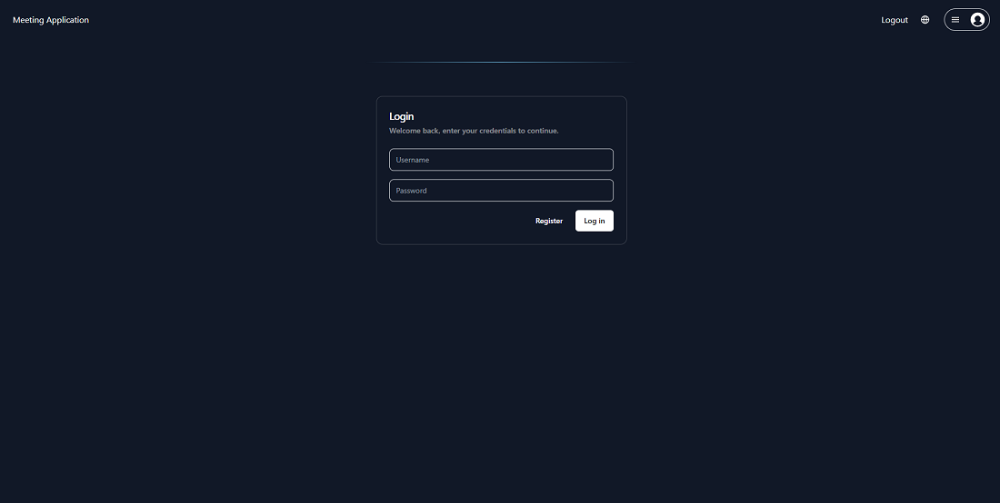
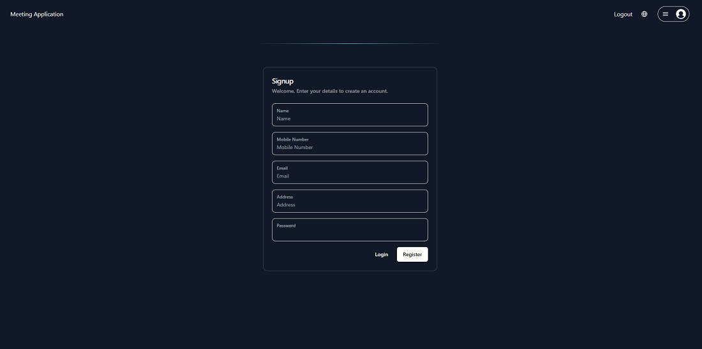
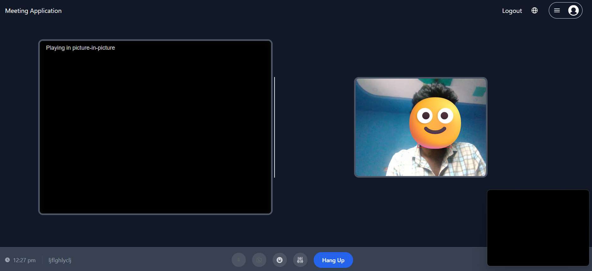
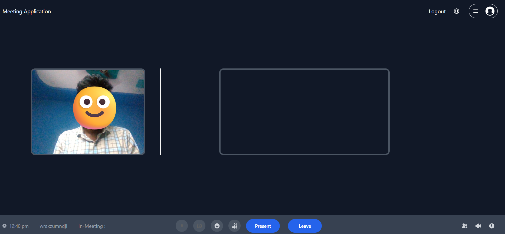

# Meeting Application

This is an Meeting Application which is a web-based tool designed for online meetings. Similar to Zoom, it offers a versatile solution for scheduling, conducting, and organizing virtual meetings. It includes features such as calendar integration, video conferencing, and participant management. 

## Tech Stack

**Client:** Html(EJS), CSS, TailwindCSS, Javascript

**Server:** Node, Express, Peerjs, Socket.io

**Database:** MongoDB(Atlas)

## Contributing

Contributions are always welcome!

## Screenshots

**Homepage**

**Login Page**

**Signup Page**

**Meeting Page of Host**

**Meeting Page of Joiner**

## Author

- [@Arjuntiruveedula](https://www.github.com/Arjuntiruveedula)

